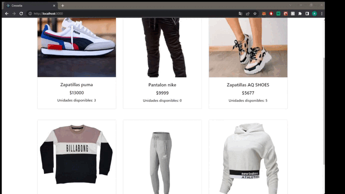

# Cresselia
Este proyecto es un E-Commerce de indumentaria, realizado con React JS

## Demo
 

## Instalacion
1) Clonar el repositorio.
2) Estando en la raiz del proyecto, corra el comando
```
npm install
```
3) Ejecutar para inciar el proyecto:
```
npm start
``` 
El proyecto estara disponible en http://localhost:3000

## Firebase
Este proyecto usa el servicio de backend de Firebase. Para que puedas ver todo correctamente deberas crear tu propio proyecto en firebase y colocar sus credenciales en un archivo .env siguiendo este ejemplo.\

```
[env.example] (https://github.com/AdrianoM96/cresselia-MIGNINI/blob/workshop/.env.example)
``` 
Además, deberás crear una coleccion y ponerle el nombre de "items" y colocarle los siguiente campos:\

* title: string
* category: string
* description: string
* image: string
* price: number
* stock: number 

Luego deberas agregar algunos productos a esta base de datos, para poder visualizarlos cuando corras el proyecto. 

La otra colecction sera "orders" y esta se creará automaticamente al crear una orden de compra.

* Contendrá algunos datos del comprador como: nombre, apellido, teléfono y su email.
* Los productos que compró.
* El total de la compra 
* La fecha en la que se realizó la orden de compra.
* El estado de la orden de compra. Predeterminadamente se da el valor de "generada"


## Contenido
Este proyecto con
* Cátalogo de todos los productos 
* Filtro por categorías, las cuales son : Hombres, Mujeres y Niños
* Detalle de cada producto , mostrando en pantalla su nombre,descripción, precio ,stock disponible y la posibilidad de poder elegir la cantidad que queremos agregar al carrito, siempre respetando el stock disponible
* Carrito: en el cual podemos ver todos los productos que hemos agregado a nuestro carrito, mostrando su imagen,nombre, cantidad elegida, sub total de cada producto y el total del carrito completo. Tenemos la posibilidad de eliminar algun producto en caso de no quererlo o eliminar el carrito por completo. Si queremos efectuar la compra, hay un boton para "Finalizar la compra", para luego ir al siguiente paso
* Formulario para que el usuario llene con informacion correcta y obligatoria, de lo contrario no podra proceder con la compra. Una vez llenado correctamente, se le da al usuario el codigo de referencia de su compra
* Control de stock: Controla que la orden de compra se puede efectuar correctamente, revisando si hay stock disponibles de los productos que quiere comprar, si hay, se genera la orden de compra , de lo contrario sale una aviso en pantalla que no hay stock uno de los productos

## Dependencias/librerias
Este proyecto de ReactJs utiliza estas dependencias/librerias.\
ReactJs -.\  Librería principal del proyecto.
React Router DOM -.\ Navegación de la App.
Firebase - Base de datos.
Bootstrap 4.2  Para el uso de estilos
SweetAlert2 Para mostrar avisos en pantalla mas estéticos

